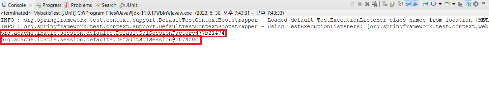

## 1. DB연결(Oracle 11g 기준)

**pom.xml -> Oracle 라이브러리 추가**

```xml
<!-- Oracle -->
<dependency>
    <groupId>com.oracle.database.jdbc</groupId>
    <artifactId>ojdbc6</artifactId>
    <version>11.2.0.4</version>
</dependency>
```

**src/test/java -> kr.co.springlegacy패키지에 OracleConnectionTest 클래스 생성**

```java
package kr.co.springlegacy;

import java.sql.Connection;
import java.sql.DriverManager;

import org.junit.Test;

public class OracleConnectionTest {

	private static final String DRIVER = "oracle.jdbc.driver.OracleDriver";
	private static final String URL = "jdbc:oracle:thin:@localhost:1521:xe";
	private static final String ID = "mytest";
	private static final String PASS = "mytest";

	@Test
	public void testConnection() throws Exception {
		Class.forName(DRIVER);
		try (Connection conn = DriverManager.getConnection(URL, ID, PASS)) {
			System.out.println(conn);
		} catch (Exception e) {
			e.printStackTrace();
		}
	}
}
```

<br>

**Run AS -> JUnit Test (테스트 실행)**<br>


## 2. DataSource Bean 생성

**pom.xml -> DataSource - Apahce DBCP API 관련 라이브러리 추가**

```xml
<!-- commons-dbcp2 -->
<dependency>
    <groupId>org.apache.commons</groupId>
    <artifactId>commons-dbcp2</artifactId>
    <version>2.9.0</version>
</dependency>

<!-- commons-pool2 -->
<dependency>
    <groupId>org.apache.commons</groupId>
    <artifactId>commons-pool2</artifactId>
    <version>2.11.1</version>
</dependency>

<!-- commons-collections -->
<dependency>
    <groupId>commons-collections</groupId>
    <artifactId>commons-collections</artifactId>
    <version>3.2.2</version>
</dependency>
```

**src/main/resource -> config/database.properties 생성**

```properties
jdbc.driver=oracle.jdbc.OracleDriver
jdbc.url=jdbc:oracle:thin:@localhost:1521/XE
jdbc.username=mytest
jdbc.password=mytest
```

**applicationContext.xml -> Namespace 확장**<br>

**applicationContext.xml -> DataSource Bean 생성** 

```xml
<?xml version="1.0" encoding="UTF-8"?>
<beans xmlns="http://www.springframework.org/schema/beans"
	xmlns:xsi="http://www.w3.org/2001/XMLSchema-instance"
	xmlns:aop="http://www.springframework.org/schema/aop"
	xmlns:c="http://www.springframework.org/schema/c"
	xmlns:context="http://www.springframework.org/schema/context"
	xmlns:jdbc="http://www.springframework.org/schema/jdbc"
	xmlns:mybatis-spring="http://mybatis.org/schema/mybatis-spring"
	xmlns:p="http://www.springframework.org/schema/p"
	xmlns:tx="http://www.springframework.org/schema/tx"
	xsi:schemaLocation="http://www.springframework.org/schema/jdbc http://www.springframework.org/schema/jdbc/spring-jdbc-4.3.xsd
		http://mybatis.org/schema/mybatis-spring http://mybatis.org/schema/mybatis-spring-1.2.xsd
		http://www.springframework.org/schema/beans http://www.springframework.org/schema/beans/spring-beans.xsd
		http://www.springframework.org/schema/context http://www.springframework.org/schema/context/spring-context-4.3.xsd
		http://www.springframework.org/schema/aop http://www.springframework.org/schema/aop/spring-aop-4.3.xsd
		http://www.springframework.org/schema/tx http://www.springframework.org/schema/tx/spring-tx-4.3.xsd">

	<context:property-placeholder location="classpath:config/database.properties" />

	<!-- Data Source -->
	<bean id="dataSource" class="org.apache.commons.dbcp2.BasicDataSource" destroy-method="close">
		<property name="driverClassName" value="${jdbc.driver}" />
		<property name="url" value="${jdbc.url}" />
		<property name="username" value="${jdbc.username}" />
		<property name="password" value="${jdbc.password}" />
	</bean>

</beans>
```

**src/test/main -> kr.co.springlegacy 패키지에 DataSourceTest 클래스 생성**

```java
package kr.co.springlegacy;

import java.sql.Connection;

import javax.inject.Inject;
import javax.sql.DataSource;

import org.junit.Test;
import org.junit.runner.RunWith;
import org.springframework.test.context.ContextConfiguration;
import org.springframework.test.context.junit4.SpringJUnit4ClassRunner;

@RunWith(SpringJUnit4ClassRunner.class)
@ContextConfiguration(locations = { "classpath:applicationContext.xml" })
public class DataSourceTest {
	@Inject
	private DataSource dataSource;

	@Test
	public void testConnection() throws Exception {
		try (Connection conn = dataSource.getConnection()) {
			System.out.println(conn);

		} catch (Exception e) {
			e.printStackTrace();
		}
	}
}
```

**JUnit Test 실행 전 applicationContext.xml -> dataSource 수정**

```xml
<!-- <bean id="dataSource" class="org.apache.commons.dbcp2.BasicDataSource" destroy-method="close"> -->
<bean id="dataSource" class="org.springframework.jdbc.datasource.DriverManagerDataSource">
    <property name="driverClassName" value="${jdbc.driver}" />
    <property name="url" value="${jdbc.url}" />
    <property name="username" value="${jdbc.username}" />
    <property name="password" value="${jdbc.password}" />
</bean>
```

**JUnit Test 실행 결과 Connection 확인 가능**


## 3. Mybatis 연결

**pom.xml -> Spring & Mybatis 연동 관련 라이브러리 추가**

```xml
<!-- Mybatis -->
<dependency>
    <groupId>org.mybatis</groupId>
    <artifactId>mybatis</artifactId>
    <version>3.5.13</version>
</dependency>

<!-- Mybatis-spring -->
<dependency>
    <groupId>org.mybatis</groupId>
    <artifactId>mybatis-spring</artifactId>
    <version>2.1.0</version>
</dependency>

<!-- spring-jdbc -->
<dependency>
    <groupId>org.springframework</groupId>
    <artifactId>spring-jdbc</artifactId>
    <version>5.3.27</version>
</dependency>

<!-- spring-test -->
<dependency>
    <groupId>org.springframework</groupId>
    <artifactId>spring-test</artifactId>
    <version>5.3.27</version>
    <scope>test</scope>
</dependency>
```

**applicationContext.xml ->  mybatis 관련 SqlSessionFactoryBean&SqlSessionTemplate Bean 생성**

```xml
<bean id="sqlSessionFactoryBean" class="org.mybatis.spring.SqlSessionFactoryBean">
    <property name="dataSource" ref="dataSource" />
    <property name="configLocation" value="classpath:/mybatis-config.xml" />
</bean>

<bean id="sqlSessionTemplate" class="org.mybatis.spring.SqlSessionTemplate">
    <constructor-arg name="sqlSessionFactory" ref="sqlSessionFactoryBean" />
</bean>
```

**src/test/main -> kr.co.springlegacy 패키지에 MybatisTest 클래스 생성**

```java
package kr.co.springlegacy;

import javax.inject.Inject;

import org.apache.ibatis.session.SqlSession;
import org.apache.ibatis.session.SqlSessionFactory;
import org.junit.Test;
import org.junit.runner.RunWith;
import org.springframework.test.context.ContextConfiguration;
import org.springframework.test.context.junit4.SpringJUnit4ClassRunner;

@RunWith(SpringJUnit4ClassRunner.class)
@ContextConfiguration(locations = { "classpath:applicationContext.xml" })
public class MybatisTest {
	@Inject
	private SqlSessionFactory sqlFactory;

	@Test
	public void testFactory() {
		System.out.println(sqlFactory);
	}

	@Test
	public void testSession() throws Exception {
		try (SqlSession session = sqlFactory.openSession()) {
			System.out.println(session);
		} catch (Exception e) {
			e.printStackTrace();
		}
	}
}
```

**JUnit Test 실행 전 applicationContext.xml -> dataSource 수정**

```xml
<bean id="dataSource" class="org.apache.commons.dbcp2.BasicDataSource" destroy-method="close">
<!-- <bean id="dataSource" class="org.springframework.jdbc.datasource.DriverManagerDataSource"> -->
    <property name="driverClassName" value="${jdbc.driver}" />
    <property name="url" value="${jdbc.url}" />
    <property name="username" value="${jdbc.username}" />
    <property name="password" value="${jdbc.password}" />
</bean>
```

**JUnit Test 실행 결과 SqlSessionFactoryBean&SqlSessionTemplate 확인 가능**


