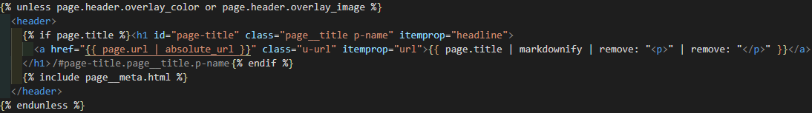
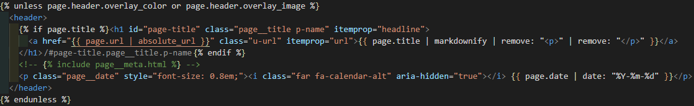
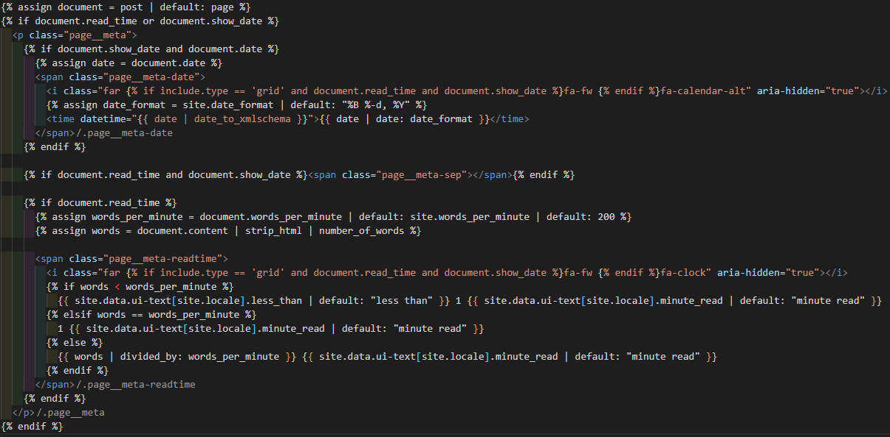

## 1. minimal-mistakes 작성 일자 설정

변경 전 

**변경 후** 

`_layouts/single.html`의 `<header>` 내 `{% include page__meta.html %)` 부분 수정

원래는 아래의 `_includes/page__meta.html`을 수정해야 되나 소스 분석하기 전 single.html 수정하는 방법 올립니다.

