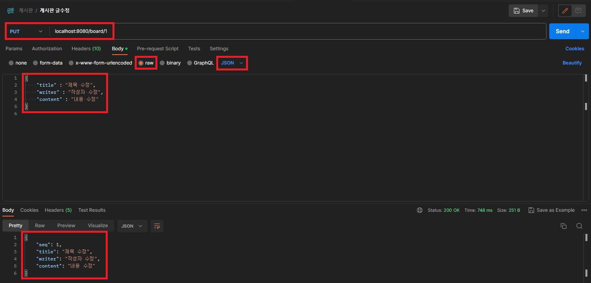

## <center>x-www-form-urlencoded, form-data, Json</center>

<center></center>&nbsp;&nbsp;&nbsp;&nbsp;&nbsp;&nbsp;&nbsp;&nbsp;&nbsp;&nbsp;&nbsp;&nbsp;&nbsp;&nbsp;&nbsp;&nbsp;&nbsp;&nbsp;&nbsp;&nbsp;&nbsp;&nbsp;&nbsp;&nbsp;<font size="3px" color="red">(Postman 사용화면)</font>

`x-www-form-urlencoded`은 일반적인 `HTML` 폼(form) 데이터 전송 방식입니다. 데이터는 `URL`인코딩되어서 `Key-Value` 쌍으로 전송되며, 일반적으로 `application/x-www-form-urlencoded` 미디어 타입으로 전송됩니다.

`form-data`는 파일 업로드를 포함한 폼 데이터 전송 방식입니다. 이 방식은 `multipart/form-data` 미디어 타입을 사용하여 데이터를 전송하며, 각 필드는 별도의 파트로 구분되어 전송됩니다. 이 때, 파일 업로드와 같이 바이너리 데이터를 전송할 수 있습니다.

따라서, 일반적인 텍스트 데이터만을 전송할 경우에는 `x-www-form-urlencoded`를 사용하고, 파일 업로드와 같이 바이너리 데이터를 전송해야 할 경우에는 `form-data`를 사용하는 것이 일반적입니다.

`raw`형태의 `JSON`은 `HTTP`요청에서 요청 본문(body)에 `JSON`데이터를 직접 작성하는 형식입니다. 일반적으로 `JSON`데이터는 `JavaScript Object Notation`의 형식을 따르며, `Key-Value`형태로 구성되며 `application/json` 미디어 타입으로 전송됩니다. 요청 본문에는 JSON 형식의 데이터가 포함되어 있습니다. 이를 서버에서는 해당 `JSON`데이터를 파싱하여 처리할 수 있습니다.


## Controller 메서드 Parameter 값 파싱

### (예시)RestFul 게시판 글수정

#### application/x-www-form-urlencoded

|                             기능                             |                            메서드                            |                         restful URI                          | <center>&nbsp;&nbsp;&nbsp;&nbsp;&nbsp;&nbsp;&nbsp;&nbsp;&nbsp;&nbsp;&nbsp;&nbsp;&nbsp;&nbsp;&nbsp;입력 필드&nbsp;&nbsp;&nbsp;&nbsp;&nbsp;&nbsp;&nbsp;&nbsp;&nbsp;&nbsp;&nbsp;&nbsp;&nbsp;&nbsp;&nbsp;</center> |
| :----------------------------------------------------------: | :----------------------------------------------------------: | :----------------------------------------------------------: | :----------------------------------------------------------- |
| &nbsp;&nbsp;&nbsp;&nbsp;&nbsp;&nbsp;&nbsp;&nbsp;&nbsp;&nbsp;&nbsp;&nbsp;&nbsp;&nbsp;&nbsp;게시판 글수정&nbsp;&nbsp;&nbsp;&nbsp;&nbsp;&nbsp;&nbsp;&nbsp;&nbsp;&nbsp;&nbsp;&nbsp;&nbsp;&nbsp;&nbsp; | &nbsp;&nbsp;&nbsp;&nbsp;&nbsp;&nbsp;&nbsp;&nbsp;&nbsp;&nbsp;&nbsp;&nbsp;&nbsp;&nbsp;&nbsp;POST&nbsp;&nbsp;&nbsp;&nbsp;&nbsp;&nbsp;&nbsp;&nbsp;&nbsp;&nbsp;&nbsp;&nbsp;&nbsp;&nbsp;&nbsp; | &nbsp;&nbsp;&nbsp;&nbsp;&nbsp;&nbsp;&nbsp;&nbsp;&nbsp;&nbsp;&nbsp;&nbsp;&nbsp;&nbsp;&nbsp;&nbsp;/board/{seq}&nbsp;&nbsp;&nbsp;&nbsp;&nbsp;&nbsp;&nbsp;&nbsp;&nbsp;&nbsp;&nbsp;&nbsp;&nbsp;&nbsp;&nbsp; | title : String<br />writer : String<br />content : String    |

```java
@PostMapping("/board/{seq}")
public ResponseEntity<BoardDTO> updateBoard(@PathVariable int seq, @ModelAttribute BoardDTO boardDTO) {
		
		boardDTO.setSeq(seq);
		
		return new ResponseEntity<>(boardDTO, HttpStatus.OK);
	}
```

`http://localhost:8080/board/1`에 `POST`요청을 하면 `@PathVariable`로 글 수정할 게시판 번호(seq)를 추출&바인딩하고 `@ModelAttribute`를 통해 제목(title), 작성자(writer), 내용(content)의 값을 `BoardDTO`에 바인딩한다. 게시판번호를 `boardDTO`에 담아 같이 리턴한다.

<center></center>

#### application/json

|                             기능                             |                            메서드                            |                         restful URI                          | <center>&nbsp;&nbsp;&nbsp;&nbsp;&nbsp;&nbsp;&nbsp;&nbsp;&nbsp;&nbsp;&nbsp;&nbsp;&nbsp;&nbsp;&nbsp;입력 필드&nbsp;&nbsp;&nbsp;&nbsp;&nbsp;&nbsp;&nbsp;&nbsp;&nbsp;&nbsp;&nbsp;&nbsp;&nbsp;&nbsp;&nbsp;</center> |
| :----------------------------------------------------------: | :----------------------------------------------------------: | :----------------------------------------------------------: | :----------------------------------------------------------- |
| &nbsp;&nbsp;&nbsp;&nbsp;&nbsp;&nbsp;&nbsp;&nbsp;&nbsp;&nbsp;&nbsp;&nbsp;&nbsp;&nbsp;&nbsp;게시판 글수정&nbsp;&nbsp;&nbsp;&nbsp;&nbsp;&nbsp;&nbsp;&nbsp;&nbsp;&nbsp;&nbsp;&nbsp;&nbsp;&nbsp;&nbsp; | &nbsp;&nbsp;&nbsp;&nbsp;&nbsp;&nbsp;&nbsp;&nbsp;&nbsp;&nbsp;&nbsp;&nbsp;&nbsp;&nbsp;&nbsp;PUT&nbsp;&nbsp;&nbsp;&nbsp;&nbsp;&nbsp;&nbsp;&nbsp;&nbsp;&nbsp;&nbsp;&nbsp;&nbsp;&nbsp;&nbsp; | &nbsp;&nbsp;&nbsp;&nbsp;&nbsp;&nbsp;&nbsp;&nbsp;&nbsp;&nbsp;&nbsp;&nbsp;&nbsp;&nbsp;&nbsp;&nbsp;/board/{seq}&nbsp;&nbsp;&nbsp;&nbsp;&nbsp;&nbsp;&nbsp;&nbsp;&nbsp;&nbsp;&nbsp;&nbsp;&nbsp;&nbsp;&nbsp; | title : String<br />writer : String<br />content : String    |

```
@PutMapping("/board/{seq}")
public ResponseEntity<BoardDTO> updateBoard(@PathVariable int seq, @RequestBody BoardDTO boardDTO) {

    boardDTO.setSeq(seq);

    return new ResponseEntity<>(boardDTO, HttpStatus.OK);
}
```

`http://localhost:8080/board/1`에 `PUT`요청을 하면 `@PathVariable`로 글 수정할 게시판 번호(seq)를 추출&바인딩하고 `@RequestBody`를 통해 `Key-Value`로 넘어오는 제목(title), 작성자(writer), 내용(content)의 값을 `BoardDTO`에 바인딩한다. 게시판번호를 `boardDTO`에 담아 같이 리턴한다.



<BR>※`restful API`에서 수정은 대부분 `PUT`으로 요청하지만 `x-www-form-urlencoded` 형식으로 데이터를 보낼 때 `PUT`으로 보내면 추출&바인딩이 되지 않는다. `PUT`으로 보내고 싶으면 `Json`형식으로 데이터를 바꿔서 `BoardDTO`에 바인딩해야한다.  

#### multipart/form-data

|                             기능                             |                            메서드                            |                         restful URI                          | <center>&nbsp;&nbsp;&nbsp;&nbsp;&nbsp;&nbsp;&nbsp;&nbsp;&nbsp;&nbsp;&nbsp;&nbsp;&nbsp;&nbsp;&nbsp;입력 필드&nbsp;&nbsp;&nbsp;&nbsp;&nbsp;&nbsp;&nbsp;&nbsp;&nbsp;&nbsp;&nbsp;&nbsp;&nbsp;&nbsp;&nbsp;</center> |
| :----------------------------------------------------------: | :----------------------------------------------------------: | :----------------------------------------------------------: | :----------------------------------------------------------- |
| &nbsp;&nbsp;&nbsp;&nbsp;&nbsp;&nbsp;&nbsp;&nbsp;&nbsp;&nbsp;&nbsp;&nbsp;&nbsp;&nbsp;&nbsp;게시판 글수정&nbsp;&nbsp;&nbsp;&nbsp;&nbsp;&nbsp;&nbsp;&nbsp;&nbsp;&nbsp;&nbsp;&nbsp;&nbsp;&nbsp;&nbsp; | &nbsp;&nbsp;&nbsp;&nbsp;&nbsp;&nbsp;&nbsp;&nbsp;&nbsp;&nbsp;&nbsp;&nbsp;&nbsp;&nbsp;&nbsp;POST&nbsp;&nbsp;&nbsp;&nbsp;&nbsp;&nbsp;&nbsp;&nbsp;&nbsp;&nbsp;&nbsp;&nbsp;&nbsp;&nbsp;&nbsp; | &nbsp;&nbsp;&nbsp;&nbsp;&nbsp;&nbsp;&nbsp;&nbsp;&nbsp;&nbsp;&nbsp;&nbsp;&nbsp;&nbsp;&nbsp;&nbsp;/board/{seq}&nbsp;&nbsp;&nbsp;&nbsp;&nbsp;&nbsp;&nbsp;&nbsp;&nbsp;&nbsp;&nbsp;&nbsp;&nbsp;&nbsp;&nbsp; | title : String<br />writer : String<br />content : String<br/>uploadFile : MultipartFile |

multipart/form-data는 파일업로드와 같이 쓰기 떄문에 파일 업로드 추가 설정하겠습니다.

```xml
<!-- presentation-layer.xml -->
<bean id="multipartResolver" class="org.springframework.web.multipart.support.StandardServletMultipartResolver" />
```

multipartReolver을 빈(bean)등록하여 추가합니다.

```XML
<!-- web.xml -->
<servlet>
    <servlet-name>appServlet</servlet-name>
    <servlet-class>org.springframework.web.servlet.DispatcherServlet</servlet-class>
    <init-param>
        <param-name>contextConfigLocation</param-name>
        <param-value>/WEB-INF/config/presentation-layer.xml</param-value>
    </init-param>
    <!-- 추가된 부분 START -->
    <multipart-config>
        <max-file-size>104857600</max-file-size> <!-- 10MB limit -->
        <max-request-size>104857600</max-request-size>
        <file-size-threshold>0</file-size-threshold>
    </multipart-config>
    <!-- 추가된 부분 END -->
</servlet>
```

 `<multipart-config>` 요소는 서블릿 3.0 이상에서 지원되는 기능이며, `web.xml` 파일에 직접 설정할 수 있습니다.

- `<max-file-size>`:
  - 파일의 최대 크기를 지정합니다. 예시에서는 10MB (10 * 1024 * 1024 바이트)로 설정되어 있습니다.
  - 이 값을 초과하는 파일은 업로드할 수 없습니다.
- `<max-request-size>`:
  - 전체 요청의 최대 크기를 지정합니다. 예시에서는 10MB로 설정되어 있습니다.
  - 이 값은 파일 업로드 및 기타 폼 데이터를 포함한 전체 요청의 최대 크기를 나타냅니다.
  - 만약 `<max-request-size>`를 `<max-file-size>`보다 작게 설정하면, 파일 업로드 크기 제한이 요청 전체에 적용됩니다.
- `<file-size-threshold>`:
  - 파일 데이터를 임시 파일로 저장하기 전에 메모리에 유지할 수 있는 최대 크기를 지정합니다.
  - 예시에서는 0으로 설정되어 있으므로 파일 데이터가 메모리에 저장되지 않고 바로 임시 파일로 저장됩니다.
  - 대용량 파일의 경우 이 값을 조정하여 메모리 사용을 최적화할 수 있습니다.

```JAVA
@RequestMapping("/board/{seq}")
public ResponseEntity<String> updateBoard(@PathVariable int seq, @ModelAttribute BoardDTO boardDTO, @RequestPart("uploadFiles") MultipartFile[] files) throws IllegalStateException, IOException {

    boardDTO.setSeq(seq);

    System.out.println("BoardDTO's ToString: " + boardDTO.toString());

    if (files != null && files.length > 0) {
        for (MultipartFile file : files) {
            System.out.println("OriginalFileName: " + file.getOriginalFilename());

            if (!file.getOriginalFilename().isEmpty()) {
                file.transferTo(new File(FILE_SERVER_PATH, file.getOriginalFilename()));
                System.out.println("File uploaded successfully.");
            } else {
                System.out.println("Please select a valid File.");
                return ResponseEntity.badRequest().body("Please select a valid File.");
            }
        }
    } else {
        System.out.println("No files were uploaded.");
        return ResponseEntity.badRequest().body("No files were uploaded.");
    }

    return ResponseEntity.ok(boardDTO.toString() + ", File(s) uploaded successfully.");
}
```

`http://localhost:8080/board/1`에 `POST`요청을 하면 `@PathVariable`로 글 수정할 게시판 번호(seq)를 추출&바인딩하고 `@ModelAttribute`를 통해 넘어오는 제목(title), 작성자(writer), 내용(content)의 값을 `BoardDTO`에 바인딩하고 `@RequestPart`를 통해 첨부파일들을 바인딩합니다. 게시판번호를 `boardDTO`와 업로드 성공 문구를 같이 리턴한다.

`BoardDTO` 클래스 안에 `MultipartFile[] uploadFiles`를 추가 해놓으면 `@ModelAttribute`를 통해 바인딩되어 파라미터에 `@RequestPart("uploadFiles") MultipartFile[] files`를 안쓰고 쓸 수 있다.

